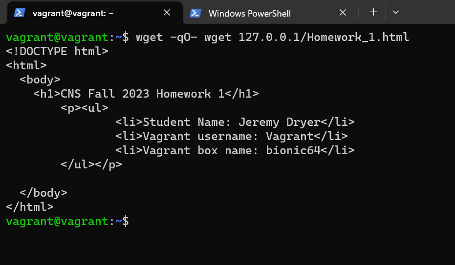
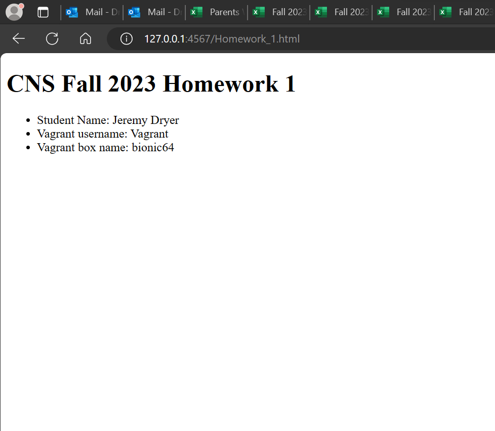
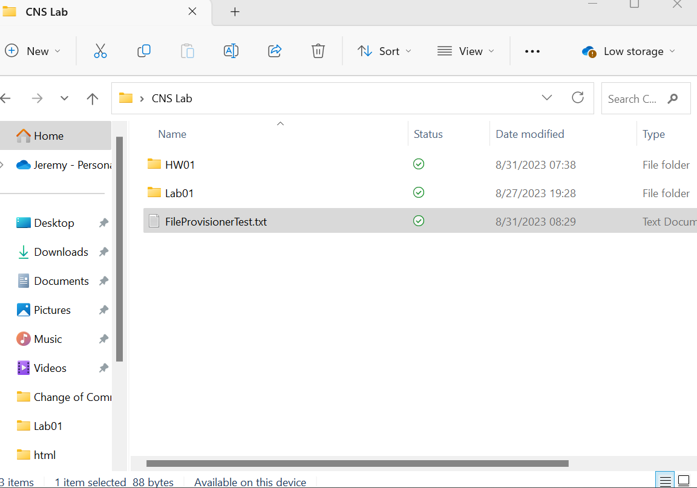
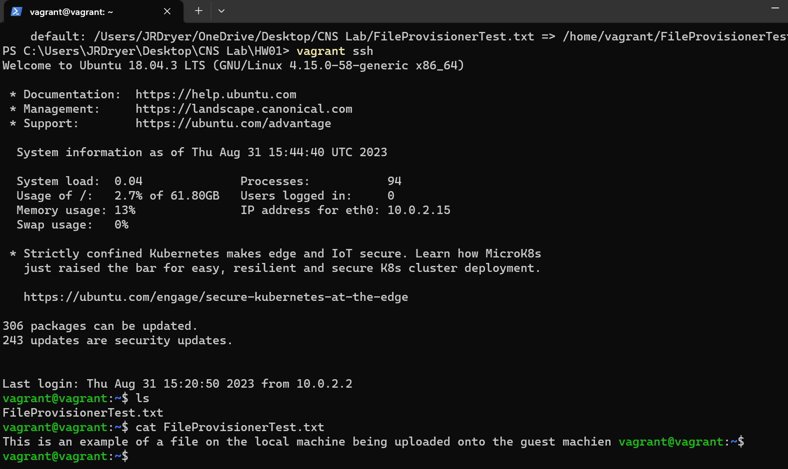

# 1/c Jeremy Dryer, 31AUG23, CNS HW01

## I was able to provision a bionic64 vagrant box with a basic Apache webserver that was able to load an HTML file on the guest machine. I was able to do this by creating a script that starts an Apache webserver and sets where the webserver will look to serve contene. I then created an html folder with an html file inside of it for the webserver to serve. I then configured the vagrantfile to run the script I wrote during start up. I was then able to on the guest machine use wget to load the html file I created and was able to verify the deployment.

## After provisioning the box I then had to configure networking. To do this I had to configure port forwarding on the vagrant file so that port 80 on the guest machine forwards to port 4567 on the host machine. After reloaded the vagrant box I was then able to go on a browser and type the IP of the guest machine, in this case 127.0.0.1 and then was able to access the HTML file in the guest machine.

## The Shell provisioner is used to run shell scripts as the root user on the guest machine. It is a basic provisioner that might not have the advanced options as puppet or chef. The Shell provisioner uses the path you set to your shell script in order to execute it. This is called an external shell. You can also use inline scripts if your script is short that will execute after starting up the guest machine. There are also arguements you can pass into your script. The Shell provisioner is super useful for setting up a simple webserver on the start of the guest machine like what was done on this homework.

## To get the file provisioner to work and copy a file from the local machine to the guest machine you have to write in the vagrant file the source of the file in a linux path even if your local file is on windows and then a linux path on the guest machine as the destination if your guest machine is a linux VM. Once the vagrant vm is provisioned it will copy the file from the local machine to the guest machine 

