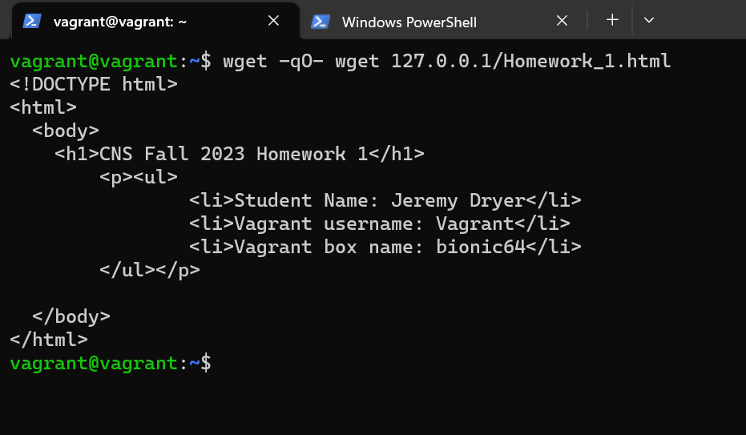

# 1/c Jeremy Dryer, 31AUG23, CNS HW01

## I was able to provision a bionic64 vagrant box with a basic Apache webserver that was able to load an HTML file on the guest machine. I was able to do this by creating a script that starts an Apache webserver and sets where the webserver will look to serve contene. I then created an html folder with an html file inside of it for the webserver to serve. I then configured the vagrantfile to run the script I wrote during start up. I was then able to on the guest machine use wget to load the html file I created

