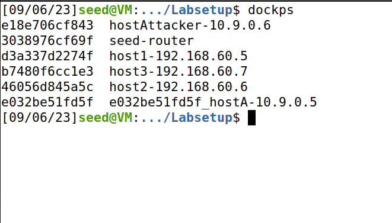

# 1/c Jeremy Dryer, 06SEP23, CNS HW02

## Two containers I found on the docker hub were vulnerables/cve-2014-6271 and a Windows contrainer. The vulnerables/cve-2014-6271 is by STRM Vulnerabel images. It is a container with cve-2014-6271 which is known as Shellshock or Bashdoor in the Unix Bash Shell. This vulnerability allows remote execution of commands on a device and allows for attackers to access a vulnerable host. There are no options on the container and it outlines how to perform an attack on the vulnerability. The Windows container is created by Microsoft and has a Windows server installed. There are numerous options that can be used depending on what version of the OS and the architecture whether is a multi architecture system or an AMD64 system. What is unique about this system is that it's officially supported by Microsoft.

## For the container I used in the HW was the official Ubuntu container. It is an official Docker image and has numerous options depending on what version of Ubuntu you want installed. This container is interesting as it is the only officail base Ubuntu Docker image that you can pull. I choose this because Ubuntu is the linux distro I am most familiar with and I was confident I could get this container to run since it was an offical Docker Image 

