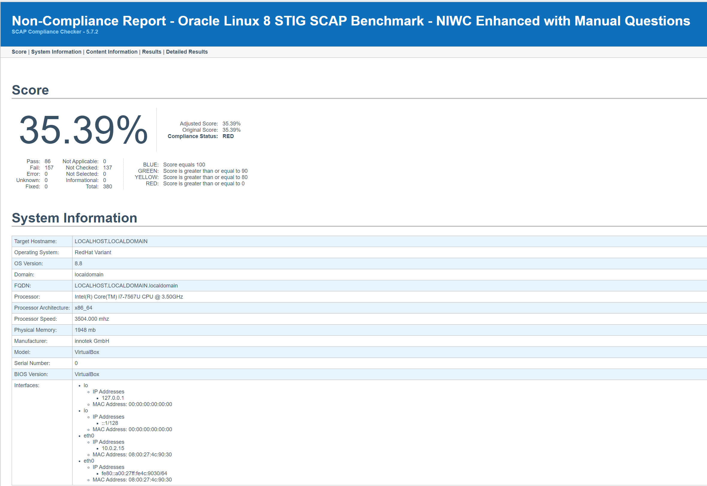
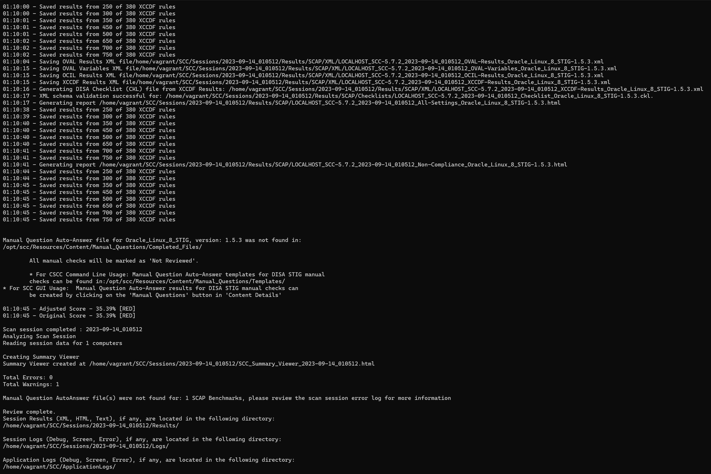

#1/c Jeremy Dryer, 14SEP23, CNS HW03

## I utilized vagrant and virtual box to create an Oracle Linux 8 box. I choose this distro since there was a easy guide on how to create it using vagrant. I choose version 8 and not 9 becaues the lab document stated the the SSC tool was not working on Oracle Linux 9.

## To download the SSC tool I used the following command wget https://dl.dod.cyber.mil/wp-content/uploads/stigs/zip/scc-5.7.2_rhel8_oracle-linux8_x86_64_bundle.zip. I had to use wget since there was no GUI for the Oracle Linux box and using wget was easier then transfering files. I then used RPM to install the tool.In order to get the SSC Scan results I just used the vagrant file transfer to get it on my local machine.

## The over score was 35.39%. There were 86 control passes and 157 control fails. There were 6 CAT I fails out of 19 controls.

