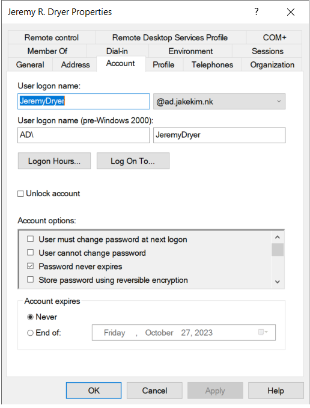
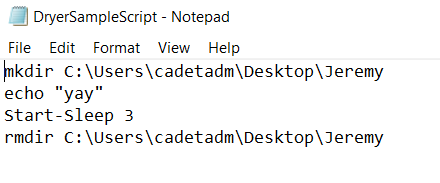
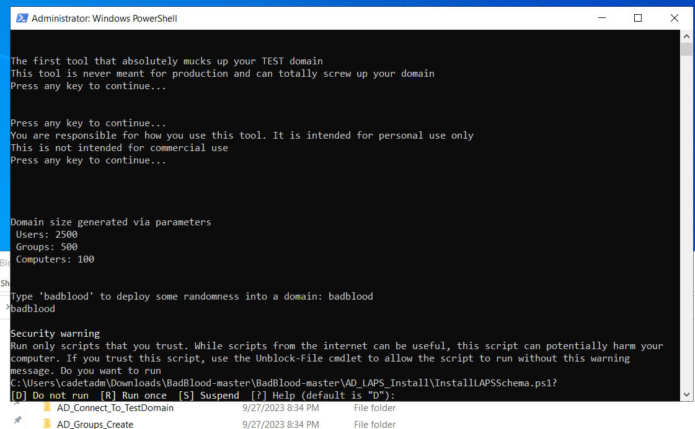
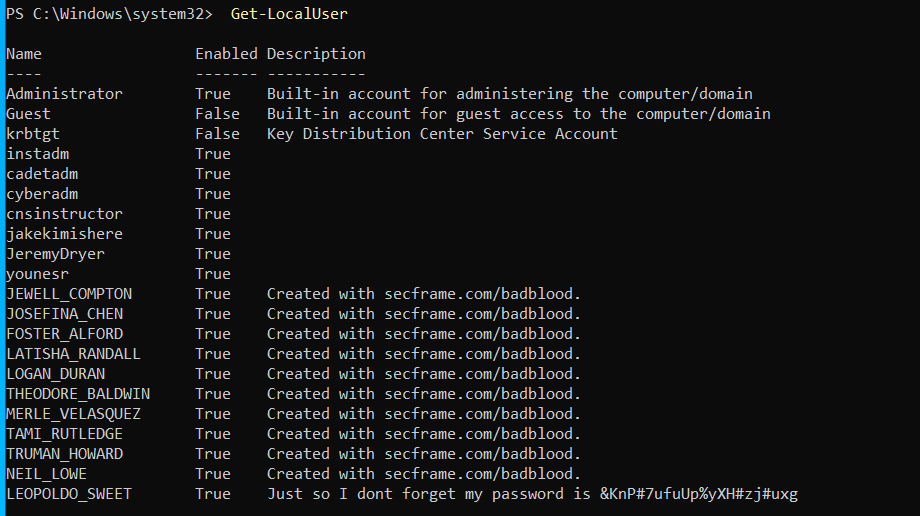
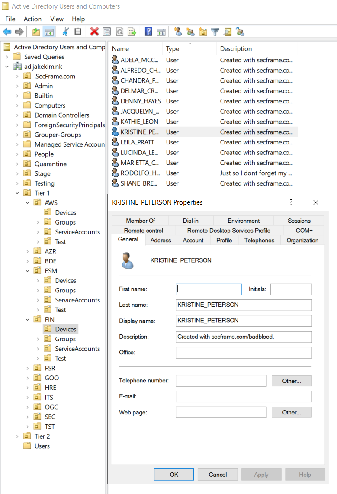

# 1/c Jeremy Dryer, 27SEP23, CNS HW04

## For section two we had to create a new active directory user. They had no administrative privlidges. I created the user Jeremy R. Dryer as it is my name. The screen shot shows that the user Jeremy Dryer is part of the jakekim.nk domain. The next screen shot shows that it does not have any administrator privledges.

## For section 3 we had to logon onto our NUCs using the new account we just created. The screen shot shows that I am logged onto the new account I created and that it is part of the active directory
!(DomainAccount.PNG)

## For this section we had to change the powershell script execution permission. We chose to change it to only allows for only signed scripts or unsigned scripts that were written on the local system. This allows for more security as not any scripts can run. 

## This section we created and tested a powershell script to demonstrate how our rules allow for scripts can run. All this script does is create a folder on the desktop and deletes it after a time.

## This section we were told to run the badblood script. This script creates a ton of users in our active directory. It created 2500 users, 500 groups and 100 computers on our active directory. Our powershell script rules asked us for approval for each subscript. The first screenshot is it asking us for permission to run a subscript. The next screenshot is a list of users created. This list does not encompass all the users created with the badblood script. The last screenshot is a random users that was created with the script.

