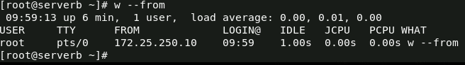
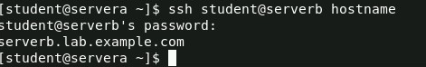
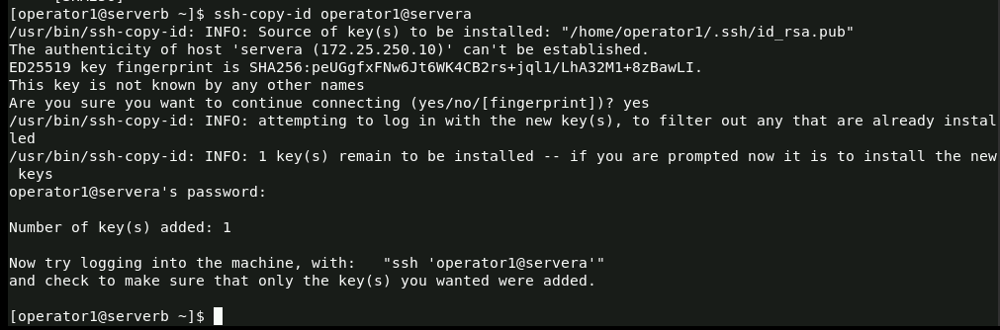
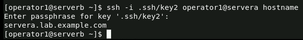
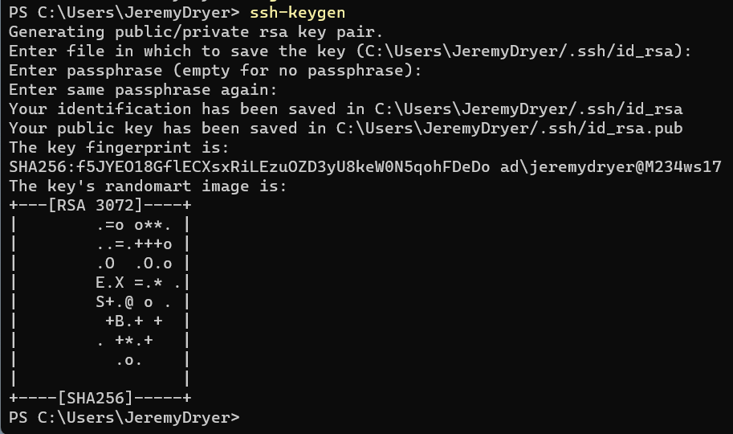
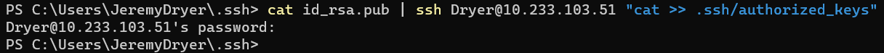
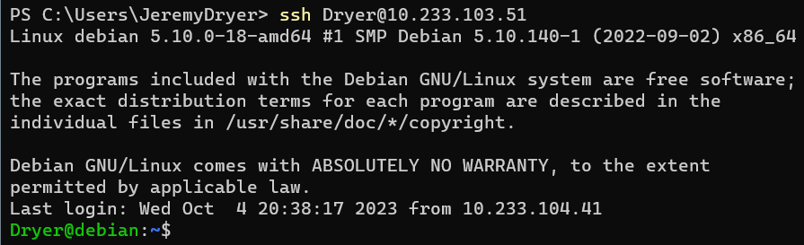
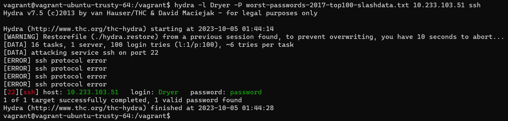

# 1/c Jeremy Dryer, 04OCT23, CNS HW05
## For 10.2 step 6 of Red Hat Academy we had to SSH into serverb as the root user. The sreenshot below demonstrates we are the root user on serevrb

## For 10.2 step 12 of Red Hat Academy we ran the hostname command on serverb from serverb without accessing an interactive shell into serverb. This demonstrates using SSH to run a command without opening a shell

## For 10.4 part 4 of Red Hat Academy we created a public key using SSH-keygen and then copied it to servera using ssh-copy-id command 

## For 10.4 part 9 of Red Hat Academy we configured our ssh on servera to only allow authenticaion thorough keys and not allow authentication through passwords. 

## For part 3 of the homework we first created a public key on our host using ssh-keygen

## Then we had to copy the key over to the jumpbox so they have the hosts public key

## I then checked the jumpbox to ensure that the local host key was on the jumpbox

## I then logged into the jumpbox using SSH and it used the key to authenticate since it did not ask me for a password 

## For part 4 I first created a Ubuntu VM using Vagrant and downloaded hydra on it. Hydra is software used for brute force attacks. I then downloaded the worst-passwords-2017-top100-slashdata.txt and put it into my VM. I also changed my jumpbox password to password as it is on the wordlist I will give to hydra. I then ran hydra with that wordlist and after some time it was able to crack it
