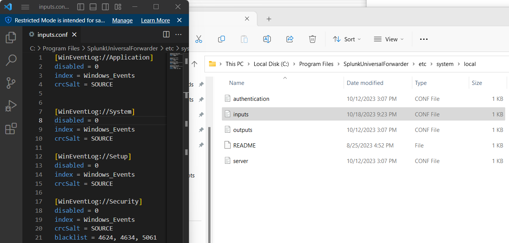

# 1/c Jeremy Dryer, 19OCT23, CNS HW06

## 2. The training I completed was the Search Under the Hood training. The training went over numerous functions to help you search for different events. The Search Job Inspector can help you analyze your searches and tell you what Splunk spent its most time on. This can help you troubleshoot your searches and help. Another tool that you can use is SPL Commenting. This works similar to comments in programming and are indicated by ``` in your Splunk search. Not only does this allow you to write comments on what a search does so it is easier to read but allows you to easily comment out searches to trouble shoot problems. This training also covers the architecture of Splunk and how searches use bloom filters to only search files that are relevant to your search.

## 4. One of the event IDs that we chose to blacklist was the event ID 4634 which means a that an account was successfully logged off. This is a very mundane event that will occur numerous times a day in a large enterprise. Seeing what domains have logged off would not be an anomaly or indicate sign of intrusion or attack. These events would just clutter our and fill up space in our Splunk server.

## 6. Below is a screenshot of the input.conf file and its location. The input file is located on the Splunk indexer at "C:\Program Files\SplunkUniversalForwarder\etc\system\local"
