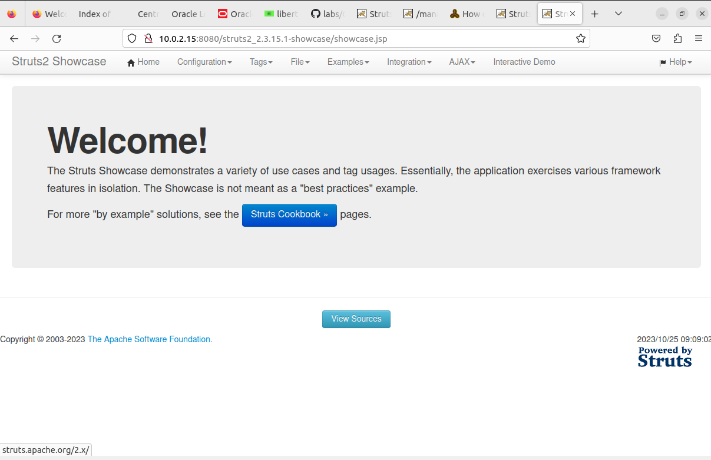
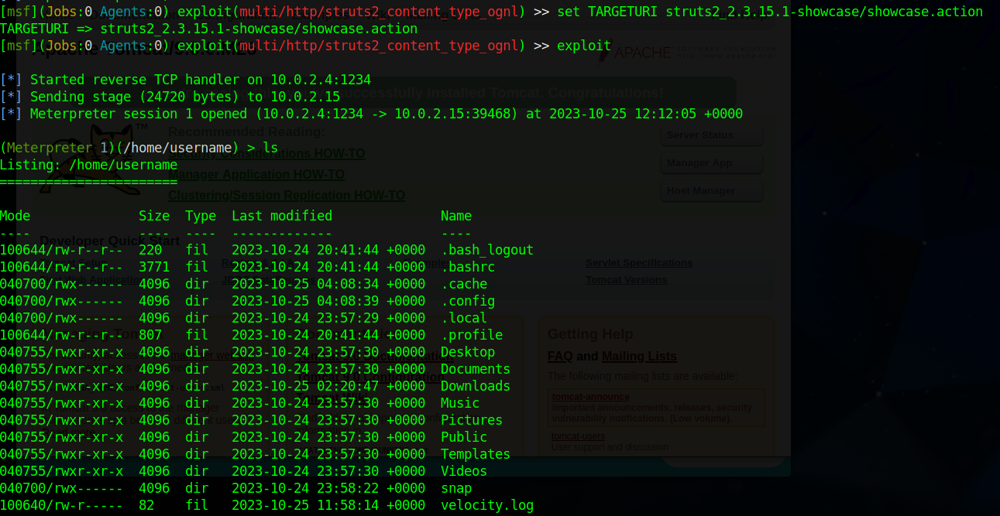

# 1/c Jeremy Dryer, 26OCT23, CNS HW07

## 2. The vulnerable service I chose for my exploit was Apache Struts2. Apache Struts 2 is a framework for java web applications. Apache Struts2 which was released in 2006 is the sequel to Struts which was released in 2000. Struts 2 is currently widely used and still in development to this day. It is a webservice and can be run in a Linux or windows environment. The vulnerability that I had researched can allow for remote command execution and it is in Struts 2 any 2.3.x version before 2.3.32. The specific version I am using to deploy the vulnerable service is 2.3.15 which was released in 2013. To test this vulnerable service, I installed it on an Ubuntu VM. I had to install numerous dependencies such as Java JDK 8, Apache Tomcat, and Apache Maven and had to configure an Apache Tomcat webserver to deploy Apache Struts 2. Below is a screenshot of a Apache Struts 2 instance running on a Ubuntu VM. 

## 3. The specific CVE of the vulnerability is CVE-2017-5638. portion that is vulnerable is the Jakarta Multipart parser which through poor error message generation and exception handling which can allow an attacker to perform remote command execution. This exploit exists in the Metasploit Framework and through msfconsole you can use exploit/multi/http/struts2_content_type_ognl module to establish a reverse shell on a host running vulnerable versions of Apache Struts 2. Below is a screenshot of a reverse shell I was able to create a reverse shell on the previous Ubuntu VM running Struts 2 with an attacker.
