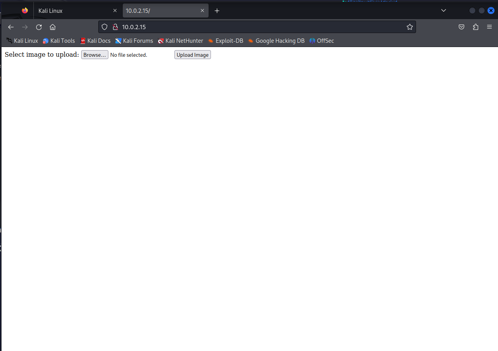

# 1/c Jeremy Dryer, 16NOV23, CNS HW08

2. Gobuster is a tool for enumerating websites and scanning what directories are available on a website. It uses HTTP and HTTPS requests to check all directories in a wordlist against a website. It can also search for certain files on a website, for example you can set Gobuster to look for .php files and can even set a username and password that it will use for any required logins from the website. Once the scan is finished Gobuster will return a report of what directories and files it found on the website and the URI of each. While Gobuster is extremely helpful, it is a very loud scanning tool as it performs many http or https request at a time. Gobuster be placed in DNS mode where after giving it a domain will search all subdomains from a given wordlist. Another mode Gobuster can be placed in is vhost mode where it will seach for virtual hosts from a given URL.
Sources: https://noobsixt9.medium.com/web-enumeration-using-gobuster-8437e7f4618d https://github.com/OJ/gobuster

3. For this demonstration I build a website that allows for files to be uploaded to the webserver to simulate a image hosting site.
 
There exists a vulnerability in the site I built in that any file can be uploaded. First step was to enumerate this website with Gobuster to find every accessible dirctory.
 
We found two uploads and photo and we can guess that any file we upload will go to one of these directories. Uploading a png image we find that they go to photos. Because we can upload anyfile to this webserver we can upload a malicious payload such as a reverse php shell. I used https://github.com/pentestmonkey/php-reverse-shell and configured it to my IP and a port I will set up a listener on. 

Once the reverse shell has been configured I set up listener using NCat

I then uploaded the reverse shell using the file uploader on the website

I then went to 10.0.2.15/photo/php-reverse-shell.php to run the reverse shell and getting a reverse shell through my Ncat listener

